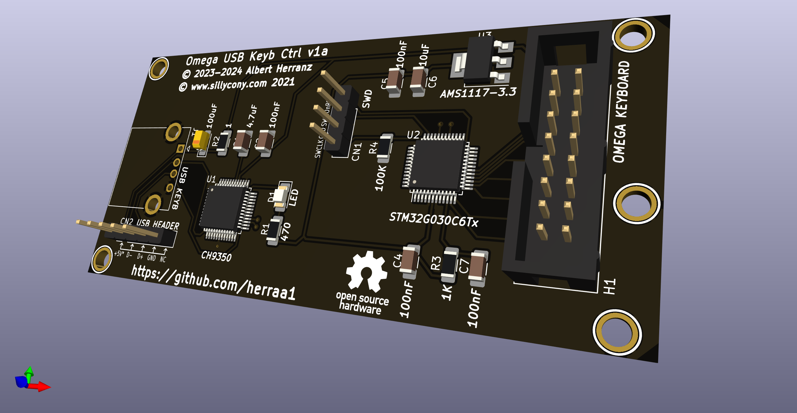
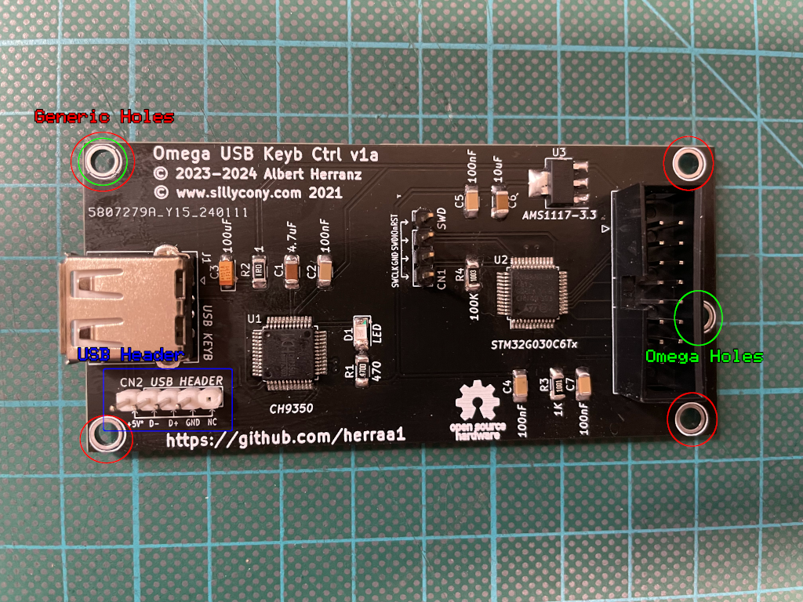
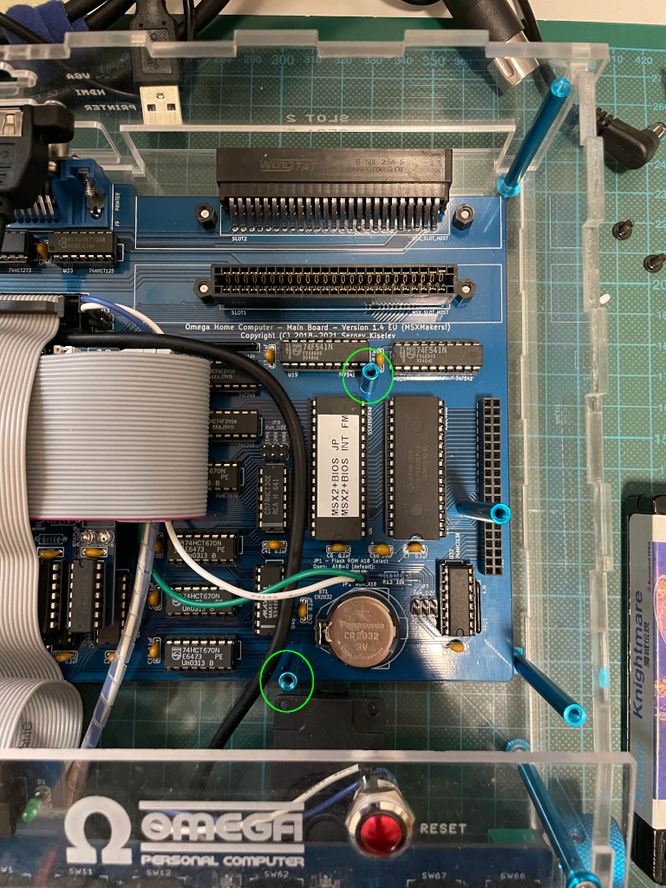
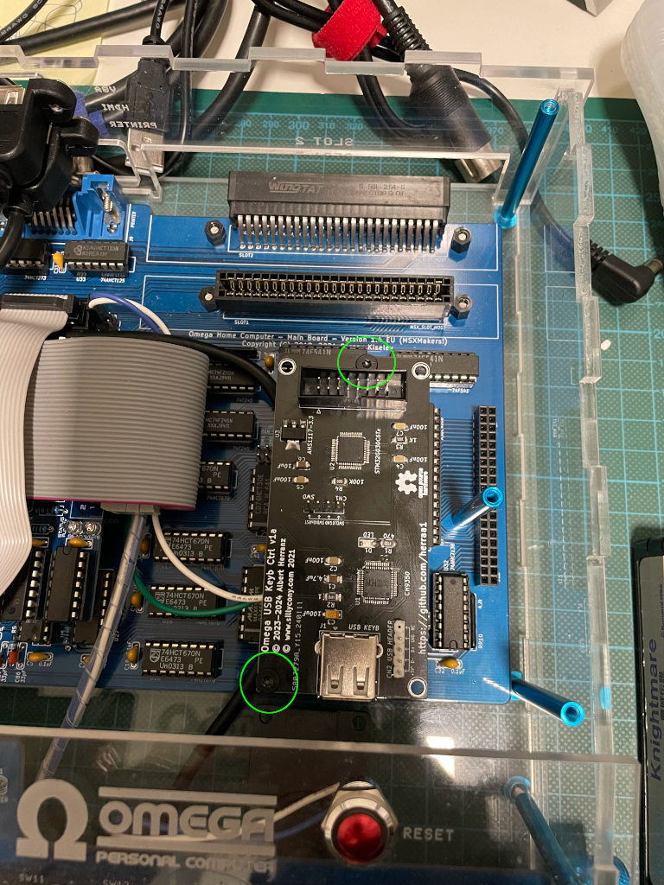
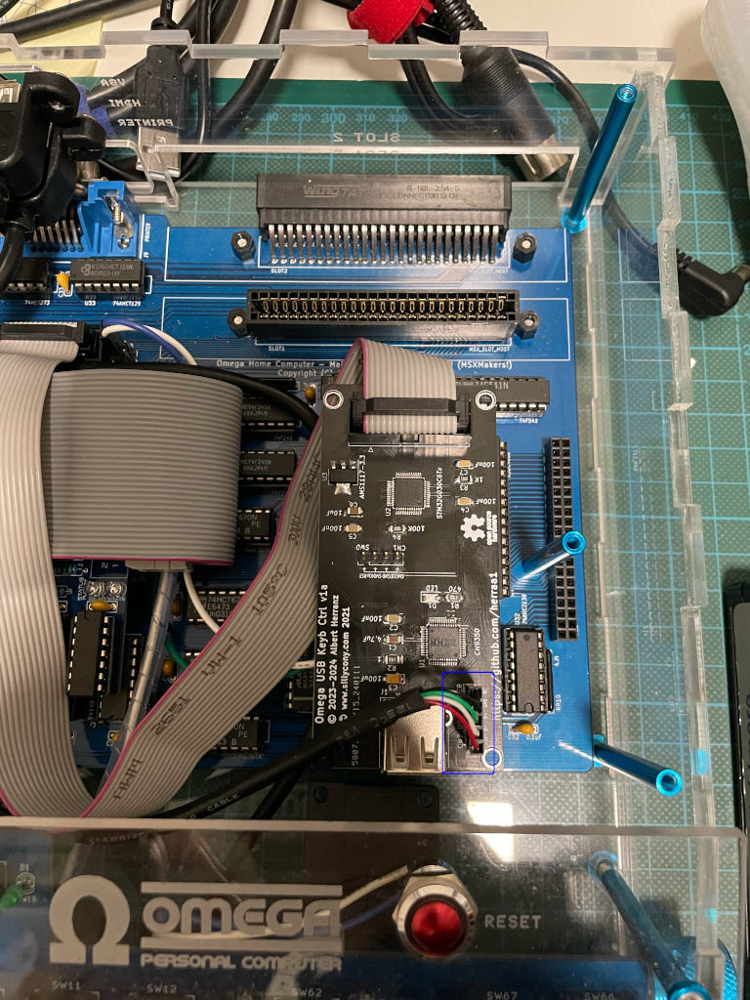

# MSX Omega Home Computer USB Keyboard Controller PCB v1a

This is a rebuild of [Censlab's USB-keyboard-to-OMEGA-converter](https://github.com/Censlab/USB-keyboard-to-OMEGA-converter) using KiCad with some slight modifications.

> [!Note]
> Sillicony became Censlab on January 2024.

## Introduction

Censlab provides (thanks!) both the firmware and gerber files of his USB-keyboard-to-OMEGA-converter free for non-commercial use under the [cc-by-sa-4.0](https://creativecommons.org/licenses/by-sa/4.0/) license.

But if you need to make slight modifications to the adapter (mecanical tweaks, component size changes, connector additions, etc.) the gerber files are not suitable.
As the adapter hardware is small and with a few components, I decided to rebuild the adapter using KiCad to facilitate my own and future modifications.

## [Hardware](hardware/kicad/)

The original USB-keyboard-to-OMEGA-converter from Censlab is designed to snap directly to the Omega Computer keyboard port, thus it doesn't include installation holes.

| |
|:--|
| Original USB-keyboard-to-OMEGA-converter from Censlab |

The adapter rebuild presented here adds the following minor modifications:
* generic installation holes (marked red in the image below)
  * can be used to attach the USB keyboard converter board anywhere
* specific two-hole configuration (marked green in the image below) to attach the USB keyboard converter board to the Omega Home Computer using two of the right side Omega main board holes
  * this simplifies installing the USB keyboard converter board on the Omega Home Computer when it collides with an internal CX-2 floppy drive controller HAT
* USB connector header (marked blue in the image below) that uses the same pinout of a PC USB header
  * this header enables the use of generic USB cables with panel mount USB connectors to easily bring the USB port to the outside of the computer case
  * this may be specially useful as the adapter is now compatible with several computers ([Omega](https://github.com/skiselev/omega), [JFF](https://github.com/konkotgit/JFF))
* silkscreen includes values for all components
* SMD component footprint sizes have been changed to 1206 to make manual soldering easier

||
|:--|
| Modified USB Keyboard Controller |

## [Firmware](https://github.com/Censlab/USB-keyboard-to-OMEGA-converter/tree/main/elf)

This board uses the unmodified firmware provided by Censlab (thanks!) to implement the keyboard controller.

## Example installation on the Omega Home Computer main PCB

## References

Censlab USB-keyboard-to-OMEGA-converter
* https://github.com/Censlab/USB-keyboard-to-OMEGA-converter

MSX Makers! OMEGA USB KEYB CTRL build instructions
* https://msxmakers.design.blog/proyectos/omega-usb-keyb-ctrl/

